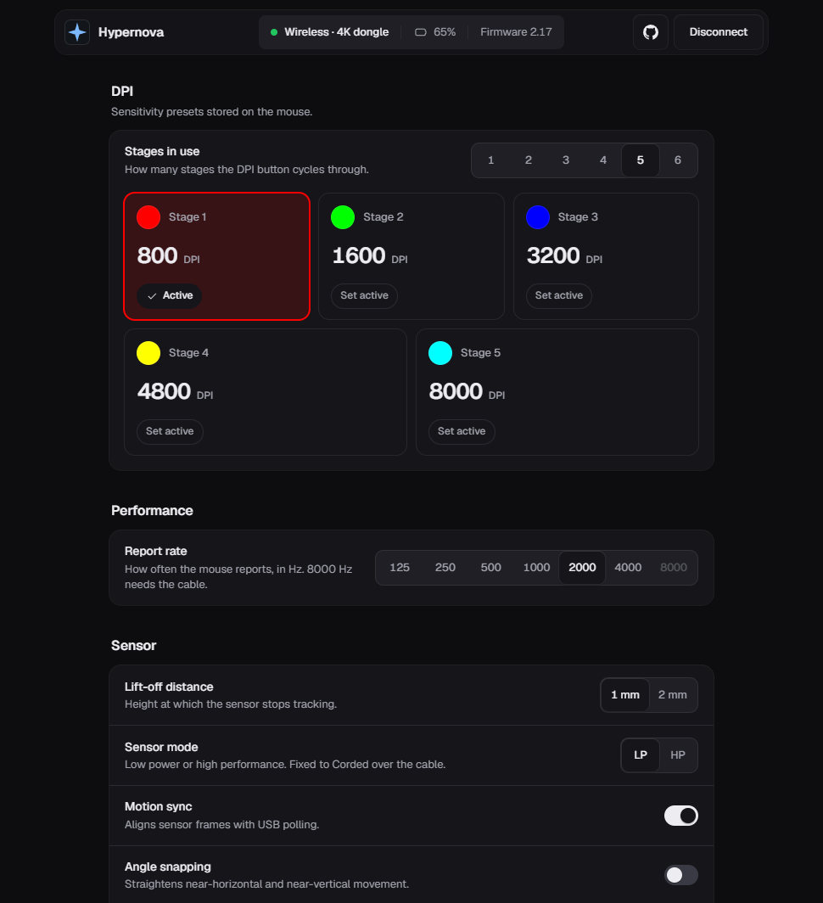

# Hypernova Web Driver

Change the settings of your Cosmic Byte Hypernova mouse from a browser tab. It works on Windows, macOS and Linux, and there's nothing to install.

**Open it: <https://hypernova.ohmygodashish.workers.dev/>**



> This is an unofficial community project, not affiliated with, endorsed by, or sponsored by Cosmic Byte.

## Get started

1. Close the Cosmic Byte app if it's running, because it can overwrite your changes.
2. Plug in the mouse with its cable, or plug in its 4K dongle.
3. Open the page in Chrome, Edge, Opera, Brave or Arc, click **Connect**, and pick the mouse.

Each change is saved to the mouse as soon as you make it. The bar at the top confirms it and shows the connection, battery and firmware.

## What you can change

| Setting | Options |
|---|---|
| DPI | Up to 6 stages, 50 to 26000 in steps of 50, with a colour per stage and the active stage |
| Report rate | 125 to 4000 Hz, or 8000 Hz over the cable |
| Lift-off distance | 1 mm or 2 mm |
| Sensor mode | Low power or high performance over the dongle (fixed over the cable) |
| Sensor extras | Motion sync, angle snapping, ripple control |
| Peak performance | On or off, and for how long |
| Debounce | 0 to 20 ms |
| Sleep time | 10 s to 40 min |
| Backup | Save all settings to a file, and restore them after reviewing what will change |

Button remapping, macros, RGB effects, firmware updates and dongle pairing aren't supported.

## Good to know

- **Unplugged the mouse or restarted the browser?** Click **Connect** again. The mouse has no serial number, so the browser can't remember it. A plain reload reconnects by itself.
- **Use one tab at a time.** Two tabs, or the installed app and a tab, would talk to the mouse at once.
- **It's careful with your mouse.** It only reads settings, writes known settings, and reads the battery and firmware version. It reads every change back to confirm it. Firmware updates and pairing are never touched.
- **You can install it.** Use the install button in the browser's address bar, and it opens in its own window and works offline.

## Browser support

The page uses WebHID, which only desktop Chromium browsers have: Chrome, Edge, Opera, Brave and Arc. Firefox, Safari and phones can't connect to the mouse.

## Linux

Your user needs permission to open the mouse. Save this rule as `/etc/udev/rules.d/70-hypernova.rules`:

```
SUBSYSTEM=="hidraw", ATTRS{idVendor}=="3554", ATTRS{idProduct}=="f5fa|f5fb", TAG+="uaccess"
```

Reload the rules, then unplug and replug the mouse or its dongle:

```
sudo udevadm control --reload-rules && sudo udevadm trigger
```

## Development

The site is plain HTML, CSS and JavaScript in `public/`, with no framework and no build step.

```
npm install
npm test
npm run dev
```

`npm run dev` serves the site at <http://localhost:8787>. The [architecture spec](docs/spec-architecture-hypernova-web-driver.md) and the [HID protocol reference](docs/spec-data-hypernova-hid-protocol.md) explain how it works.

## License

MIT, see [LICENSE](LICENSE). The Geist font in `public/fonts/` is under the SIL Open Font License.
